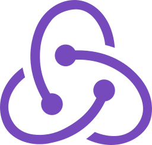
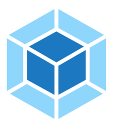
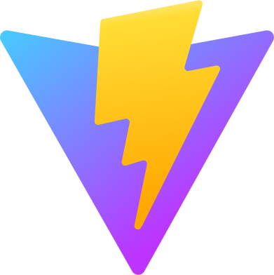

# 💫 About Me:
Hey there! 👋 I'm Ivan, a passionate junior web developer with a love for coding and exploring cutting-edge technologies. In my free time, you'll find me tackling challenges on Codewars, diving into technical articles, and constantly expanding my skill set.
Connect with me on Email at ivankosteev-it@yandex.ru or [Telegram](https://t.me/ivan_veetsok). Let's connect!

### :hammer_and_wrench: Languages and Tools :
  

  

  

  

  

  

  

  

  

  

  

  

  

  

  

  

  
  
  

---

### 📊 My Stats :
<table>
  <tr>
    <td>
      
    </td>
    <td>
      
    </td>
  </tr>
</table>

---
### :desktop_computer: My Projects for sharing:
SPA:
- [Task Master](https://github.com/veetsok/task-master) : https://master-task.netlify.app

- [Sneakers Store](https://github.com/veetsok/4_react_sneakers) : https://sneakers-store-onekos.netlify.app 

- [TodoList](https://github.com/veetsok/mern_todolist-js) : https://kiatodo-site.netlify.app

- [Fishing Store](https://github.com/veetsok/fishingStore)

- [Headphone Store](https://github.com/veetsok/airpods_store) : https://airpods-store.netlify.app

Landing pages:
- [Discover And Create NFTs](https://github.com/veetsok/discover_nft) : https://discover-nft.vercel.app

- [WELBEX](https://github.com/veetsok/WELBEX_Landing) : https://welbex-landing-veetsok.netlify.app

- [Bio Test](https://github.com/veetsok/bio-test-app) : https://bio-test.netlify.app

- [Js Technics Store](https://github.com/veetsok/digital__test) : https://digital-test-veetsok.netlify.app

- [POSH](https://github.com/veetsok/Posh_Js) : https://veetsoklanding.netlify.app
