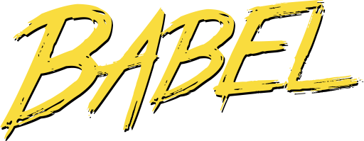
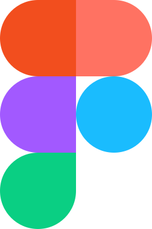
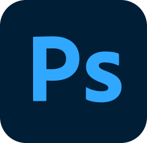

# 💫 About Me:
Hi there! 👋 Thanks for stopping by! My name is Ivan, and  I'm a junior web developer. Whether it's creating full stack applications, websites, or something new for the web, I combine stellar design, optimal UI/UX, and industry best practices for the tech stack. How to reach me: Telegram - [@ivan_veetsok](https://t.me/ivan_veetsok). Let's connect!

# 💻 Tech Stack:
  

  

  

  

  

  

  

  

  

  

  

  

  

  

  

  

  
  
  

# 📊 GitHub Stats:
 
 
 
 

---
